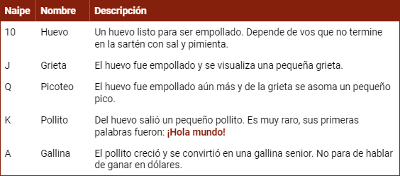
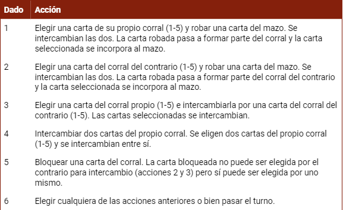
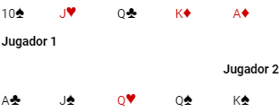
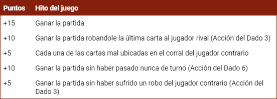
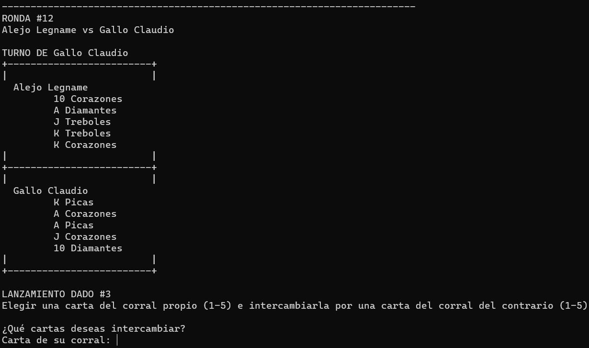
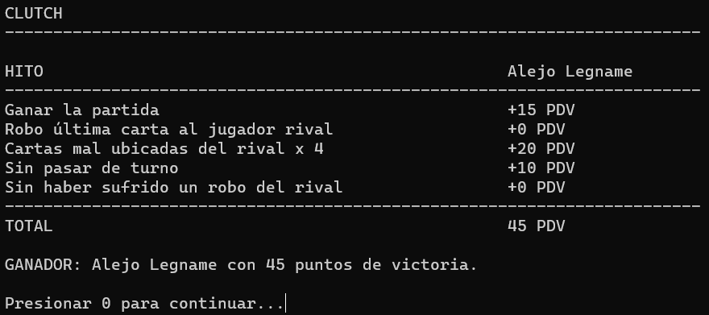

# Clutch - Console Board Game

## Project Structure
- **src:** Project source files in C++.
- **bin:** Generated executables.
- **obj:** Object files generated during compilation.
- **.gitignore:** Specifies which files and folders to ignore in the repository.

## Game

### Description
Clutch is an exciting turn-based board game for two players that uses selected cards from the French deck and a 6-sided die. The cards represent the different stages of a hen's growth.

### Game Rules
Each player manages a pen composed of five cards. The goal is to organize them in ascending order, from 10 to A. During their turn, each player rolls a die to execute various strategic actions.

### Game Over
When a player successfully organizes the cards in their pen in ascending order, the game ends. At this point, victory points are counted to determine the total score.

Illustration of a completed game:  

### Victory Points

## In-game Screenshots
### Main Menu

### Gameplay

### Score Calculation

## Credits
- Game invented by Angel Simón.
- Inspired by the board game "Jardinero," marketed by Maldón.

## Notes
Restarting the game is not necessary to start a new match.
