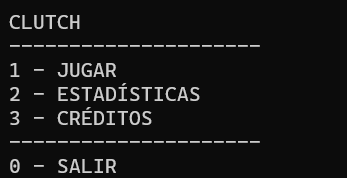

# Clutch - Juego de Mesa en Consola

## Descripción
Clutch es un emocionante juego de mesa para dos jugadores que utiliza cartas seleccionadas del mazo de la baraja francesa y un dado de 6 caras. El objetivo es completar la secuencia de cada una de las fases del crecimiento de una gallina.

## Reglas del Juego
Clutch se juega con cartas representando distintas etapas del crecimiento de una gallina: Huevo, Grieta, Picoteo, Pollito y Gallina. Cada jugador tiene un corral de cinco cartas y el objetivo es ordenarlas del 10 al A. Los jugadores lanzan un dado para realizar acciones como intercambiar cartas, robar del mazo o bloquear una carta.

## Estructura del Proyecto
* **src:** Contiene los archivos fuente del proyecto en C++.
* **bin:** Almacena los ejecutables generados.
* **obj:** Contiene archivos objeto generados durante la compilación.
* **.gitignore:** Archivo que especifica qué archivos y carpetas se deben ignorar en el repositorio.

## Instrucciones de Ejecución
1. Clona el repositorio: `git clone https://github.com/AlejoLg1/Clutch-Game.git`
2. Compila el proyecto.
3. Ejecuta el juego.

## Cómo Jugar
Los jugadores lanzan un dado y realizan acciones según el resultado. Pueden intercambiar cartas, robar del mazo, bloquear cartas o realizar otras acciones estratégicas para ordenar sus corrales.

## Menú Principal

## Créditos
Juego inventado por Angel Simón. Inspirado en el juego de mesa Jardinero comercializado por Maldón.
