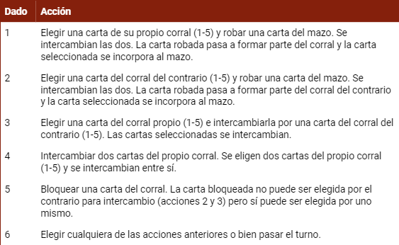

# Clutch - Juego de Mesa en Consola

## Estructura del Proyecto
- **src:** Archivos fuente del proyecto en C++.
- **bin:** Ejecutables generados.
- **obj:** Archivos objeto generados durante la compilación.
- **.gitignore:** Especifica qué archivos y carpetas ignorar en el repositorio.

## Juego

### Descripción
Clutch es un emocionante juego de mesa por turnos para dos jugadores que utiliza cartas seleccionadas del mazo de la baraja francesa y un dado de 6 caras. Las cartas representan las distintas etapas del crecimiento de una gallina.

### Reglas del Juego
Cada jugador maneja un corral compuesto por cinco cartas. El objetivo es organizarlas en orden ascendente, del 10 a la A. Durante su turno, cada jugador lanza un dado para ejecutar diversas acciones estratégicas.

### Partida Finalizada 
Cuando un jugador consigue organizar las cartas de su corral en orden ascendente, la partida llega a su fin. A partir de este momento, se procede al conteo de puntos de victoria para determinar el puntaje total.

Ilustración de una partida finalizada:  

### Puntos de Victoria

## Capturas de pantallas in-game
### Menú Principal

### Partida

### Conteo de puntos

## Créditos
- Juego inventado por Angel Simón.
- Inspirado en el juego de mesa Jardinero comercializado por Maldón.

## Notas
No es necesario reiniciar el juego para comenzar una nueva partida.
